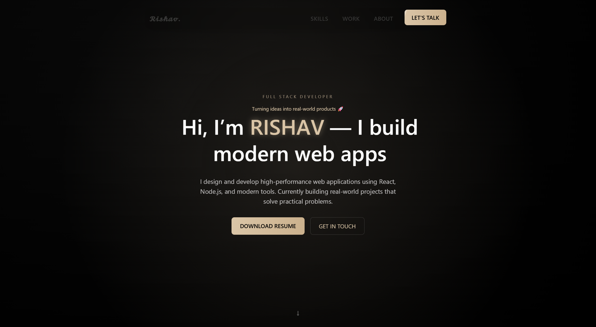
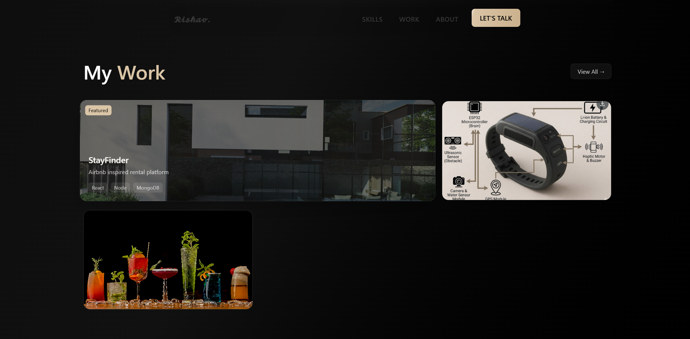
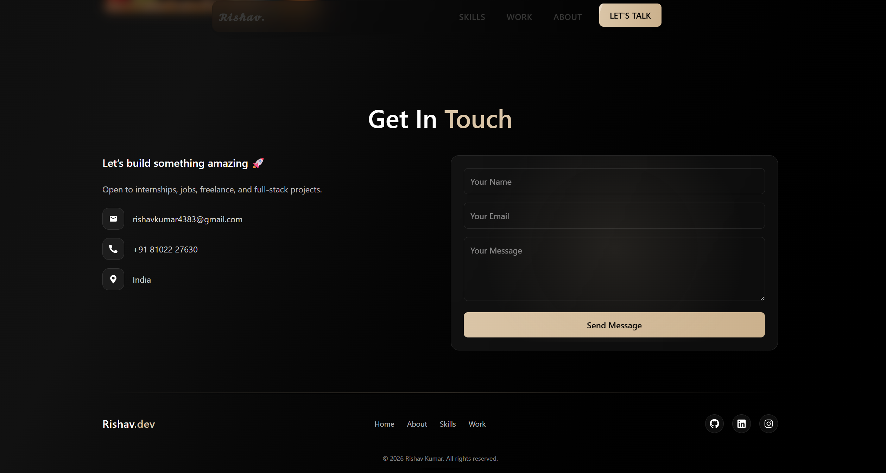

# Rishav Kumar | Web Developer Portfolio

  
 

---

## 🌟 About Me

Hi! I'm **Rishav Kumar**, a passionate **full-stack web developer**.  
I specialize in creating interactive, responsive, and modern web applications using **React**, **TailwindCSS**, and smooth animations with **GSAP**.

I enjoy turning ideas into reality and continuously learning new technologies to enhance user experiences.

---

## 📑 Table of Contents

- [Features](#-features)
- [Tech Stack](#-tech-stack)
- [Projects](#-projects)
- [Screenshots](#-screenshots)
- [Getting Started](#-getting-started)
- [Resume](#-resume)
- [Social Links](#-social-links)
- [Future Enhancements](#-future-enhancements)
- [Credits](#-credits)

---

## ✨ Features

- Engaging **Home Section** with animated hero text
- **About Section** highlighting skills and journey
- **Skills Section** with interactive tech badges
- **Projects Section** with live demos and source code
- **Contact Form** for inquiries and collaboration
- Responsive **Navbar** & **Footer** with social links
- Resume download button for quick access
- Smooth **GSAP animations** for text, sections, and scrolling effects
- Modern design inspired by **glassmorphism** and minimalism

---

## 🛠 Tech Stack

| Frontend   | Styling       | Animations | Icons & Media |
| ---------- | ------------- | ---------- | ------------- |
| React.js   | TailwindCSS   | GSAP       | React Icons   |
| JavaScript | CSS3          | SplitType  | SVG & Images  |
| HTML5      | Responsive UI |            |               |

---

## 💻 Projects

| Project              | Description                           | Live Demo | Source Code |
| -------------------- | ------------------------------------- | --------- | ----------- |
| AgroKart Marketplace | E-commerce platform for farmers       | [Live](#) | [GitHub](#) |
| SmartSight           | Wearable device for visually impaired | [Live](#) | [GitHub](#) |
| Portfolio Website    | My personal portfolio                 | [Live](#) | [GitHub](#) |

_(Replace # with your project URLs)_

---

## 🖼 Screenshots

**Home Section**

  
 

### About & SKILL

  
  

**Projects Section**

  

### Contact

  
  

---

### AUTHOR

Rishav kumar
